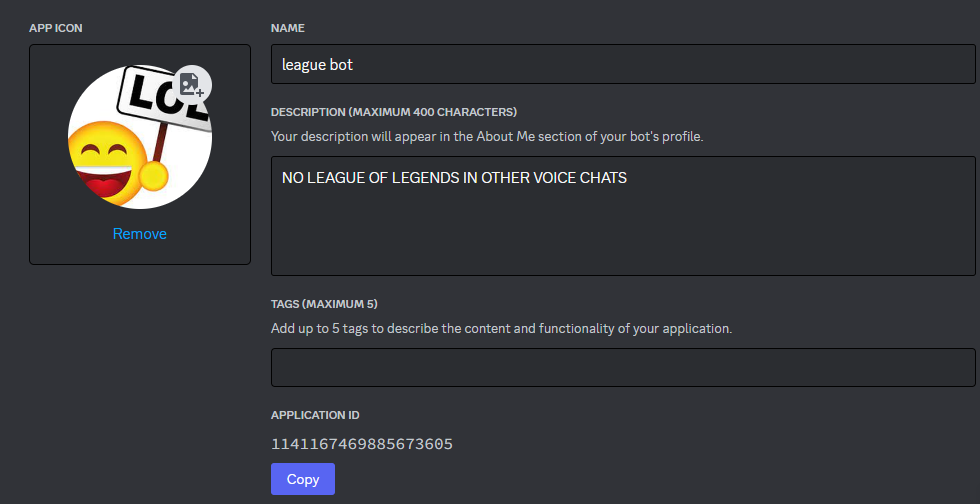
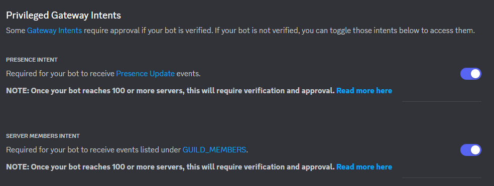

# league vc mover

tired of league players in your voice chat? 

blasting you with comms that you don't know or care about?

maybe even saying slurs you've never heard of before?


well now you can automatically move them (every 10 seconds) to a different voice chat!

you can also change the game to something else, like Brawlhalla!

requires [NodeJS version >= v16.11.0](https://nodejs.org/en/download/current)

1. after installing NodeJS, run `npm i` in the root of the folder in a terminal (CMD, PowerShell, etc).
2. create a `.env` file, which should look like this.
```
token=BOT_TOKEN
client=CLIENT_ID
guild=GUILD_ID
```
3. go to the [Discord Developer Portal](https://discord.com/developers/applications) and create a New Application.
4. copy the Application ID on your new application, and place it into the `.env` where `CLIENT_ID` is.


5. Press Reset Token, then copy the new token and place it into the `.env` where `BOT_TOKEN` is.
6. go to the Bot tab and enable these 2 Intents.


7. go to Discord, Settings > Advanced > Developer Mode, right click on the server this bot will be in, press Copy ID, and place it into the `.env` where `GUILD_ID` is.

8. invite the bot to your server with this link, replacing CLIENT_ID with your Client/Application ID: https://discord.com/oauth2/authorize?client_id=CLIENT_ID&permissions=8&scope=bot

9. in the server, right click on the Voice Channel you want to move people to, and Copy ID, and place it into the `config.json` file, replacing `VOICE_CHANNEL` with it.
9. right click on your self, Copy ID, and place it into the `config.json` file, replacing `ADMIN` with it. this will allow you to use `/toggle` and `/change-game`.

9. in terminal in the root of the folder, type `node index.js` and it should start up
